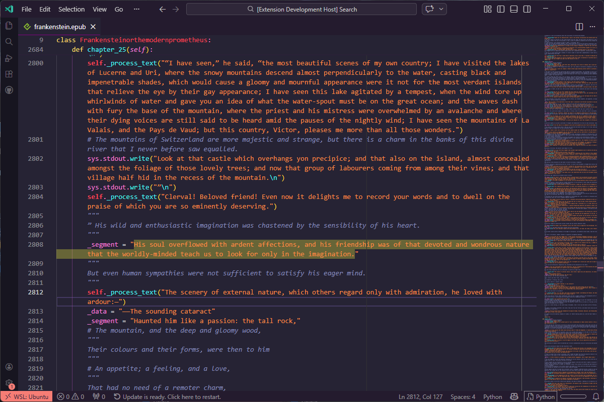

# CodeReader

> **Shhh... you're working.**

CodeReader is a VS Code extension that renders EPUB ebooks as syntax-highlighted source code. Book content is wrapped in realistic-looking classes, methods, comments, and docstrings so your "code review" is actually the next chapter of your novel.

Supports 18 programming languages (and counting) for rendering, remembers your reading position across sessions, and lets you save and manage highlighted passages.



## Table of Contents

- [Features](#features)
- [Requirements](#requirements)
- [Installation](#installation)
- [Usage](#usage)
- [Commands](#commands)
- [Configuration](#configuration)
- [Supported Languages](#supported-languages)
- [Known Issues](#known-issues)
- [Roadmap](#roadmap)
- [Changelog](#changelog)
- [License](#license)

## Features

- **Stealth rendering** - EPUB content is transformed into realistic-looking source code using classes, methods, docstrings, comments, and variable assignments.
- **18 languages** - Switch the rendering language at any time via the status bar or command palette. Choices include Python, TypeScript, Rust, Go, Java, Clojure, and more.
- **Auto-registers for `.epub` files** - Double-clicking any `.epub` in the Explorer opens it directly in CodeReader.
- **Progress tracking** - Your scroll position is saved per book and restored the next time you open it.
- **Highlights** - Select any text and it is saved as a highlight (yellow background). Highlights persist across sessions.
- **Hover tooltips on highlights** - Hover over a highlighted passage to preview it and get a one-click "Remove highlight" link.
- **Remove highlights** - Via the right-click context menu, the command palette, or the hover tooltip.
- **Word wrap** - Automatically enables word wrap when a book is opened (configurable).
- **Read-only documents** - The virtual document cannot be accidentally edited.
- **Status bar indicator** - Shows the active rendering language; click it to switch.

## Installation

### From the VS Code Marketplace

> Search for **CodeReader** in the Extensions view (`Ctrl+Shift+X`) and click **Install**.

### From a `.vsix` Package

1. Download the latest `.vsix` file from the [Releases](../../releases) page.
2. In VS Code, open the Extensions view (`Ctrl+Shift+X`).
3. Click the **`...`** menu in the top-right corner and choose **Install from VSIX…**
4. Select the downloaded file.

## Usage

### Opening a Book

**Option A - Command palette:**

1. Press `Ctrl+Shift+P` (or `Cmd+Shift+P` on macOS).
2. Run **CodeReader: Open EPUB**.
3. Select any `.epub` file.

**Option B - File Explorer:**

Double-click any `.epub` file in the VS Code Explorer. CodeReader is the default editor for `.epub` files and should open automatically (or be an option if opening a binary ePUB, such as one with complex formatting or images).

### Switching the Rendering Language

- Click the language indicator in the **status bar** (bottom-right, visible whenever a book is open).
- Or run **CodeReader: Switch Language** from the command palette.

The book re-renders immediately in the chosen language. The setting is saved globally.

### Highlights

- **Add:** Select any text - it is highlighted automatically after a short debounce delay (~600 ms). You can also run **CodeReader: Highlight Selection** from the command palette.
- **Remove:** Right-click anywhere inside a highlighted passage and choose **CodeReader: Remove Highlight**, or hover over the passage and click the **Remove highlight** link in the tooltip.

### Progress

Your reading position (the topmost visible line) is saved continuously. The next time you open the same book, the view is restored to where you left off.

## Commands

| Command | Title | Description |
|---|---|---|
| `codereader.openEpub` | CodeReader: Open EPUB | Opens a file picker to select an `.epub` file. |
| `codereader.switchLanguage` | CodeReader: Switch Language | Displays a quick-pick menu to change the rendering language. |
| `codereader.removeHighlight` | CodeReader: Remove Highlight | Removes the highlight at the current cursor position (also available in the editor context menu). |

## Configuration

Settings are available under **Settings → Extensions → CodeReader** or in `settings.json`.

| Setting | Type | Default | Description |
|---|---|---|---|
| `codereader.language` | `string` | `"python"` | Programming language used to render EPUB content. See [Supported Languages](#supported-languages) for valid values. |
| `codereader.wordWrap` | `boolean` | `true` | Automatically enable word wrap when opening a book. Does not affect other editors. |

**Example `settings.json`:**

```json
{
  "codereader.language": "rust",
  "codereader.wordWrap": true
}
```

## Supported Languages

| Label | Setting Value |
|---|---|
| Bash | `shellscript` |
| Batch | `bat` |
| C | `c` |
| C# | `csharp` |
| C++ | `cpp` |
| Clojure | `clojure` |
| Go | `go` |
| Java | `java` |
| JavaScript | `javascript` |
| Objective-C | `objectivec` |
| PHP | `php` |
| PowerShell | `powershell` |
| Python | `python` |
| Ruby | `ruby` |
| Rust | `rust` |
| Swift | `swift` |
| TypeScript | `typescript` |
| Visual Basic | `vb` |

## Known Issues

- **Basic HTML stripping** - EPUB HTML is processed with regex-based tag removal. Heavily formatted EPUBs (tables, nested lists, custom fonts) may produce stray characters or awkward line breaks.
- **No image support** - Images embedded in EPUBs are silently ignored (they would rather break the disguise anyway).
- **Chapter titles** - Chapter titles are currently generated as `Chapter 1`, `Chapter 2`, etc. Actual titles from the EPUB TOC are not yet extracted.
- **Large EPUBs** - Very large books are rendered in one pass and held in memory. Opening them may be slow on low-spec machines.

### 0.0.1

- Initial release.
- EPUB parsing via `adm-zip` and `xml2js`.
- Code generation in 18 programming languages.
- Reading progress saved and restored per book.
- Text selection highlights saved and restored per book.
- Highlight hover tooltips with one-click removal.
- Right-click context menu for removing highlights.
- Status bar language indicator with quick-pick switcher.
- Word wrap automatically applied when opening a book.
- Auto-registers as default editor for `.epub` files.

## License

[MIT](LICENSE)
